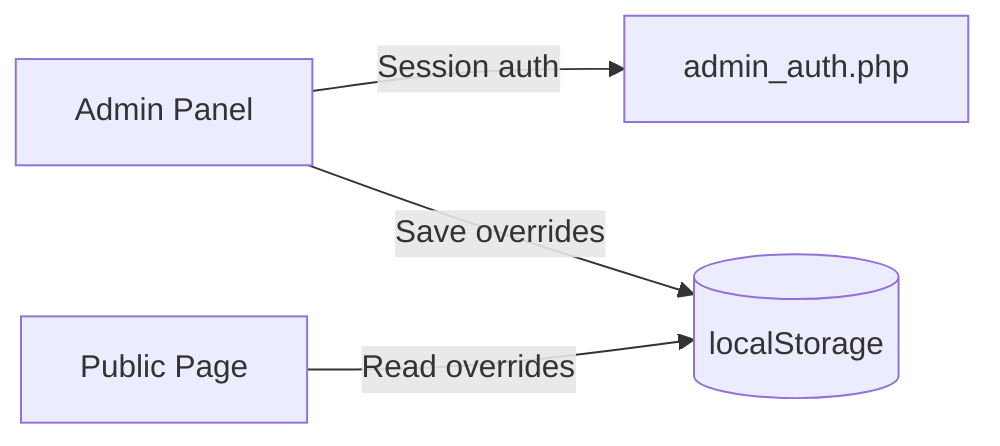

# Portfolio Website

> Single-page portfolio with animated UI and a lightweight admin panel.

<p align="center">


</p>

---

## Overview

A dark-themed, fully responsive portfolio built with vanilla HTML, CSS, and JavaScript on the frontend, plus a lightweight admin dashboard. Content for the Skills and Journey sections can be updated through the admin dashboard without touching the main HTML file.

---

## Site Features

### Public Portfolio Page

| Area | What it does |
|------|--------------|
| **Hero** | Full-width cover photo with left-to-right wipe slideshow, image preloading, and per-slide focus positioning |
| **Navigation** | Fixed glass-style navbar, smooth anchor scrolling, and active-section highlighting (scrollspy) |
| **About** | Two-column layout with stat cards and dynamically calculated age display |
| **Skills** | Multi-card grid with animated progress bars, staggered scroll reveals, and mouse-follow glow effect |
| **Journey** | Vertical timeline for education and milestones |
| **Contact** | Call-to-action buttons for email and social links |

### Visual & Motion

| Feature | Details |
|---------|---------|
| **WebGL particles** | Shader-based particle field rendered on a dedicated canvas |
| **Canvas particles** | Full-page interactive particle network with mouse tracking and connection lines |
| **Lenis smooth scroll** | Inertial scrolling with nav link interception |
| **Scroll reveals** | Directional entrance animations (`from-left`, `from-right`, `from-bottom`, `scale-up`) |
| **Section backgrounds** | Full-bleed cover images with per-section gradient overlays |
| **Glass UI** | Frosted cards, gradient accents, and subtle hover transitions |
| **Reduced motion** | Respects `prefers-reduced-motion` for accessibility |

### Performance

- Particle count scales down on smaller screens
- Animations and slideshow pause when the tab is in the background
- Skill-card mouse glow updates are throttled via `requestAnimationFrame`
- Passive event listeners where applicable

---

## Admin Panel

| Feature | Details |
|---------|---------|
| **Authentication** | Server-side PHP session login with offline fallback mode |
| **Skills editor** | Edit section title, subtitle, and skill cards (add / remove cards, 3 skills per card with percentage bars) |
| **Journey editor** | Edit timeline title and items (add / remove entries with date, heading, description) |
| **Enquiry inbox** | (Legacy) View previously submitted enquiries (requires MySQL database setup) |
| **Content storage** | Skills and journey overrides saved to `localStorage` and applied on the public page at runtime |

---

## Backend & Security

| Layer | Implementation |
|-------|----------------|
| **Security headers** | `nosniff`, `SAMEORIGIN`, referrer policy via PHP and `.htaccess` |
| **CSP** | Content Security Policy meta tag on the main page |
| **Authentication** | Server-side PHP session check for the admin dashboard |
| **Legacy Enquiry Backend** | Optional MySQL connection (`db.php`), API endpoints (`submit_enquiry.php`, `get_enquiries.php`), rate limiting, and request guard rules (inactive on public page) |
| **File protection** | `db.php` blocked from direct web access; directory listing disabled |

---

## Tech Stack

```
Frontend          Backend           Tooling / Hosting
────────          ───────           ──────────────────
HTML5             PHP 8+            Apache + .htaccess
CSS3              MySQL             XAMPP / WAMP / LAMP
JavaScript (ES6)  PDO               phpMyAdmin (optional)
WebGL             Session auth
Canvas 2D
Lenis 1.1.9
Fetch API
localStorage
```

---

## Project Structure

```
.
├── anjana_sithum_portfolio.html    # Main single-page site
├── admin.html                      # Admin dashboard
├── .htaccess                       # Root security & access rules
│
├── 20260702_133219.jpg             # Hero cover photo
├── about_bg1.png                   # About background
├── skills_bg.png                   # Skills section background
├── journey_bg.png                  # Journey section background
├── contact_bg.png                  # Contact section background
│
└── backend/
    ├── .htaccess                   # Backend security headers
    ├── db.php                      # Database credentials (inactive/legacy)
    ├── admin_auth.php              # Login, logout, session status
    ├── submit_enquiry.php          # Public enquiry submission (inactive/legacy)
    └── get_enquiries.php           # Admin-only enquiry retrieval (inactive/legacy)
```

---

## Page Sections

```
┌─────────────────────────────────────────────┐
│  Skip Link  ·  Nav  ·  Particle Canvases    │
├─────────────────────────────────────────────┤
│  #hero        Cover photo · intro · pills   │
│  #about       Bio · stat cards              │
│  #skills      Skill cards · progress bars   │
│  #education   Journey timeline              │
│  #contact     Social / email links          │
└─────────────────────────────────────────────┘
```

---

## Setup

### Requirements

- Apache with `.htaccess` support (`AllowOverride All`)
- PHP 8.0+ (optional: only required for the admin login panel session check)

### Run locally

1. Place the project folder inside your local server directory (e.g., `htdocs` or `www`).
2. Start Apache.
3. Open `anjana_sithum_portfolio.html` in the browser.
4. Open `admin.html` to manage content.

---

## Data Flow



---

## Browser Support

Works in all modern browsers that support:

- CSS Grid & Flexbox
- ES6 JavaScript
- WebGL (gracefully skipped if unavailable)
- Fetch API

---

<p align="center">
  <sub>Built with HTML · CSS · JavaScript · PHP · MySQL</sub>
</p>
